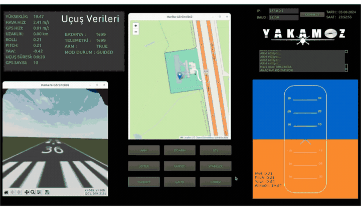
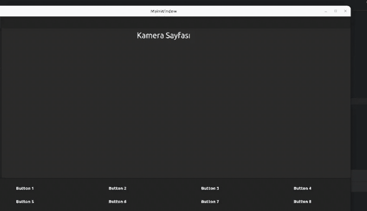
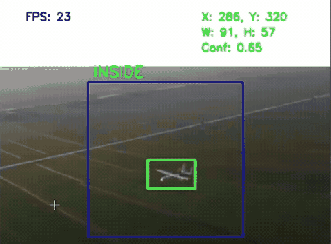

# Bilal Eroğlu

**AI / Backend Engineer** — LLM applications, agentic systems, Python backends

Software engineering student (B.Sc., expected 2027) building LLM-powered backends end to end —
architecture, API layer, model integration and deployment. Based in Istanbul.

[LinkedIn](https://www.linkedin.com/in/bilal-eroglu) · bilaleroglu3663@gmail.com

---

## AI & Backend

### [Profaix (HamzAi)](https://github.com/bilalerg/HamzAi) — Multi-tenant LLM agent platform
A conversational layer over an ERP API, built for Turkish SMB accounting workflows. ~10,000 lines of Python.

- LLM intent router on Claude Haiku classifying requests into **16 accounting intents** — invoicing, e-invoice issuance, collections, waybills, counterparty records, reporting — dispatching each to its backend workflow
- Multi-tenant layer: per-tenant ERP credentials encrypted with Fernet, tenant-resolution middleware, 5-minute TTL cache to cut database round-trips
- Role-based access control across 4 roles, enforced in middleware at the request-path level
- OCR receipt ingestion (Tesseract + OpenCV), bulk Excel/PDF import with automatic counterparty resolution
- Per-transaction usage metering, JWT auth with bcrypt hashing, automated schema migrations, structured logging

`Python` `FastAPI` `PostgreSQL` `SQLAlchemy` `Claude API` `Tesseract OCR` `Docker`

### [Fissler AI Support](https://github.com/bilalerg/fissler-ai-destek) — Agentic RAG for technical support
A tool-calling agent that answers customer questions strictly from official product manuals and warranty documents.

- **Two-stage retrieval:** metadata-filtered search scoped to the user's registered product family alongside a general-document pass — preventing answers from one product model bleeding into another
- PDF ingestion pipeline tagging every page with product-family metadata before chunking and embedding into a FAISS index
- Product registration tool writing to PostgreSQL and automatically deriving warranty and maintenance dates
- Containerised with Docker, rebuilding the vector index at container start; Chainlit chat mounted on a FastAPI application

`Python` `LangGraph` `LangChain` `OpenAI API` `FAISS` `FastAPI` `Docker`

---

## Robotics & Computer Vision

### [Yakamoz UAV (Ulgen-2)](https://github.com/bilalerg/Yakamoz-UAV-Autonomous-Landing) — Autonomous multi-target payload delivery
Autonomous mission software for a UAV that reached the **finals of the TEKNOFEST International UAV Competition**.

- 9-state finite state machine driving a complete mission: takeoff → lawnmower area scan → vision-based alignment → descent → payload release → target switch → return to launch
- ROS 2 vision node using HSV colour segmentation and contour corner analysis (`approxPolyDP`) to distinguish a red triangle from a blue hexagon in real time
- Sequential target masking so a completed target is ignored in later mission phases
- Proportional controller converging alignment to under **10 px** of pixel error, velocity clamped at 0.5 m/s with a 5-second target-loss timeout
- AUTO ↔ GUIDED mode switching, programmatic waypoint generation and upload, NED-frame velocity commands over MAVLink

`Python` `ROS 2 Humble` `ArduPilot SITL` `MAVLink` `Gazebo` `OpenCV`

### [Ground Control Station for UAV](https://github.com/bilalerg/GCS)

### [YOLO with CSRT tracking](https://github.com/bilalerg/Yolo-with-Csrt)

### [Space Game — Unity](https://github.com/bilalerg/Game-with-Unity)

2D space shooter built in Unity with C#.

---

## Stack

**AI / LLM** — Claude API · OpenAI API · LangGraph · LangChain · RAG · FAISS · pgvector · tool / function calling · intent classification

**Backend** — Python · FastAPI · REST APIs · PostgreSQL · SQLAlchemy · Supabase · Pydantic · JWT / OAuth2 · RBAC · multi-tenant architecture

**Vision & Robotics** — OpenCV · YOLO · ROS 2 · ArduPilot · MAVLink · Tesseract OCR

**Infrastructure** — Docker · Git · Linux
